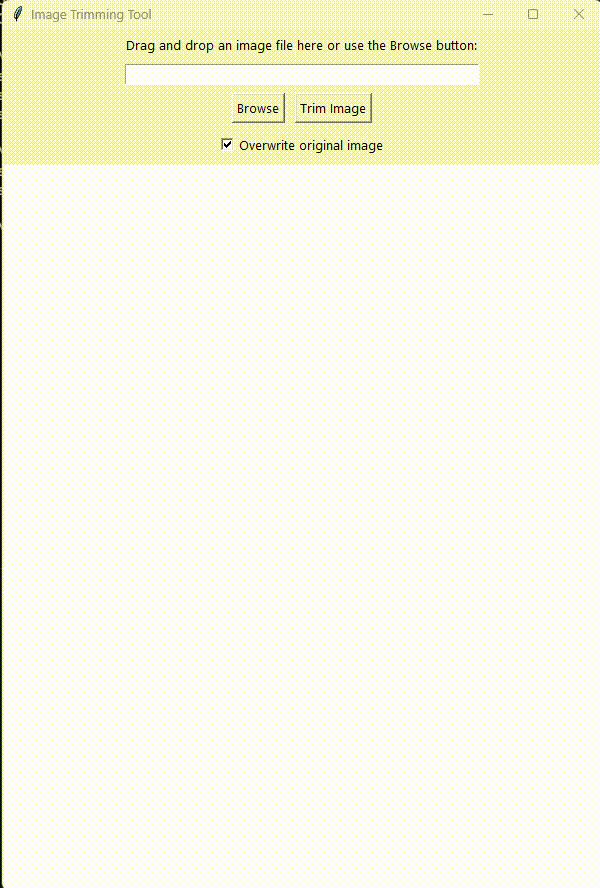

# Image Horizontal Trimmer

A Python tool for horizontally trimming of images using Tkinter and the Python Imaging Library (PIL). This application allows users to manually select the top and bottom boundaries of the part they want removed from the image. This can be useful for trimming comics like Manhwa.

## Features

- **Drag and Drop Support**: Easily drag and drop images into the application GUI.
- **Manual Y-Position Selection**: Select the start and end Y-positions directly on the image. These are draggable.
- **Overwrite Option**: Choose whether to overwrite the original image or save the trimmed image as a new file.
- **Supports Multiple Formats**: Compatible with PNG, JPG, JPEG, and WEBP formats.

## Installation

1. **Clone the repository**.
2. **Install the required dependencies**:
    ```bash
    pip install Pillow
    ```
    ```
    pip install tkinterdnd2
    ```

3. **Run the application**:
    ```bash
    python comictrim.py
    ```

## Usage

1. **Open the application**: Run the script to open the GUI.
2. **Load an image**: Drag and drop an image file into the application or use the "Browse" button to select an image file.
3. **Select Y positions**: Click on the image to set the top *(red)* and bottom *(blue)* boundaries.
4. **Trim the image**: Click the "Trim Image" button to process the image. If you unchecked the "Overwrite original image" option, the output will be saved with `_trimmed` appended to the filename.
5. **View the result**: The trimmed will be displayed in the application.

## Example


## Contributing

Feel free to open issues.

## License

This project is licensed under the MIT License.
